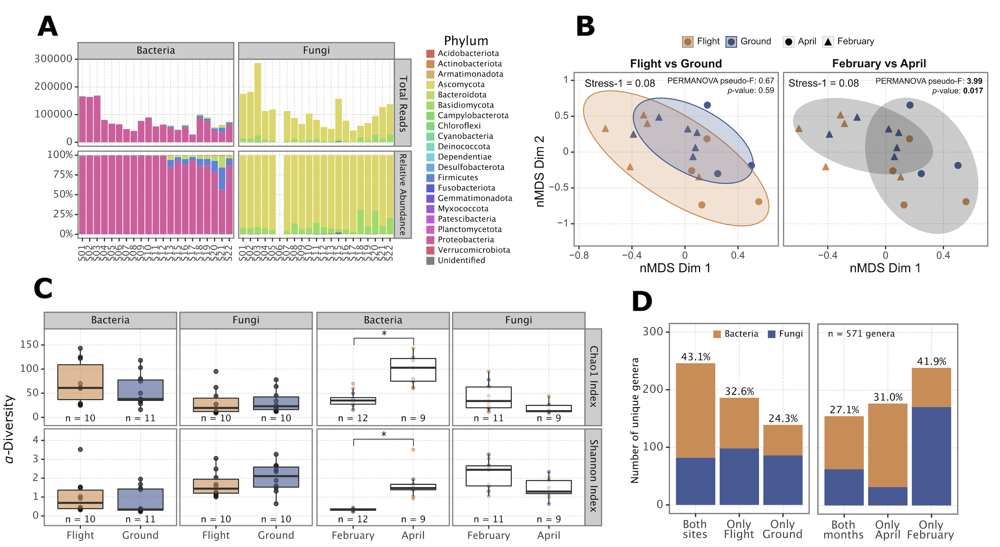

# Microbial richness and air chemistry in aerosols above the PBL confirm 2,000-km long-distance transport of potential human pathogens

 [](https://opensource.org/licenses/MIT)

[](https://zenodo.org/doi/10.5281/zenodo.13270671)




This repository holds the data and code for the analysis of the manuscript "Microbial richness and air chemistry in aerosols above the PBL confirm 2000-km long-distance transport of potential
human pathogens", now published in *PNAS*.


To reproduce the environment used in this analysis, you can use the `environment.yml` file to create a conda environment with all the necessary packages. To do so, run the following command:

```bash
conda env create -f environment.yml
```


The different data sources can be found in the [`data`](/data/) folder. The code and script used to generate the analysis and figures can be found in the different `.ipynb` files in the [`project`](/project/) directory.


The main notebook is [`project/microbial_diversity_analysis.ipynb`](/project/microbial_diversity_analysis.ipynb), with the code generating most of the analysis and figures of the manuscript. It is too large to be rendered on GitHub so either clone the repo and explore it locally or go to the Quarto render of the projects's notebooks hosted in the Github Pages of this repository [here](https://airlabbcn.github.io/microbial-richness-troposphere).